<picture>
  <source media="(prefers-color-scheme: dark)" srcset="./assets/hero-dark.svg">
  <source media="(prefers-color-scheme: light)" srcset="./assets/hero-light.svg">
  
</picture>

### Repositories

| | |
|---|---|
| **[tanuki-context](https://github.com/Osyna/tanuki-context)** — [npm](https://www.npmjs.com/package/tanuki-context) | MCP server + CLI. Cuts the token cost of feeding logs and command output to an LLM by **79–91%** — renders bulky text as dense image pages, or parks it outside the context window for retrieval by slice. Prices every strategy in real currency against the target model and **refuses to compress when plain text is cheaper**: two of the four files in its own published evaluation were correctly rejected. No model-based summarisation — error output survives character-for-character, secrets are never rasterised. Zero runtime dependencies. MIT. |
| **[Macaw](https://github.com/Osyna/Macaw)** — [macaw.osyna.com](https://macaw.osyna.com) | Local-first speech-to-text, Linux + Windows. **28 models across 8 inference engines** — Whisper, Moonshine, Parakeet TDT, Canary-Qwen, Voxtral, sherpa-onnx — hot-swappable at runtime. CUDA decode with ROCm/CPU fallback, every backend isolated in its own venv, nothing leaves the machine. v0.22.1 · 22 releases · MIT. |
| **[QuestionAir](https://github.com/Osyna/QuestionAir)** | Generates and validates multiple-choice assessments from source material. LLaMA 3.1 via Ollama, embedding-based keyword extraction, French QC through spaCy. FastAPI + Pydantic + SQLite behind Next.js 14. |
| **[Tiingo-python](https://github.com/Osyna/Tiingo-python)** | Strictly typed client for the Tiingo market-data API — EOD, IEX intraday, crypto, FX, fundamentals. `httpx`, full annotations, `uv`/`ruff`/`hatchling`. |
| **[RadiAll](https://github.com/Osyna/RadiAll)** | Radial application launcher for Wayland, written in Rust. |
| **[Pinna](https://github.com/Osyna/Pinna)** | Self-hostable alternative to Mapstr — Vue, ready to deploy. |

Also [`QML`](https://github.com/Osyna/QML) ·
[`AzureBlobStorageExplorer`](https://github.com/Osyna/AzureBlobStorageExplorer) ·
[`GrafanaPrometheus_4_Coolify`](https://github.com/Osyna/GrafanaPrometheus_4_Coolify) ·
[`YTM-Player`](https://github.com/Osyna/YTM-Player) ·
[`Dot.Files`](https://github.com/Osyna/Dot.Files)

### Stack

<picture>
  <source media="(prefers-color-scheme: dark)" srcset="./assets/stack-dark.svg">
  <source media="(prefers-color-scheme: light)" srcset="./assets/stack-light.svg">
  
</picture>

---

<a href="mailto:contact@osyna.com">contact@osyna.com</a> ·
<a href="https://osyna.com">osyna.com</a> ·
<a href="https://www.linkedin.com/in/irvinheslan">linkedin</a> ·
Brussels, BE

Neither panel is a static image: <a href="./scripts/render.mjs"><code>scripts/render.mjs</code></a>
pulls live figures from the GitHub and npm APIs and re-renders both themes of both panels; a
<a href="./.github/workflows/pulse.yml">nightly Action</a> commits the refresh. No shields.io,
no third-party stat-card service — nothing that can go down but this repo.

